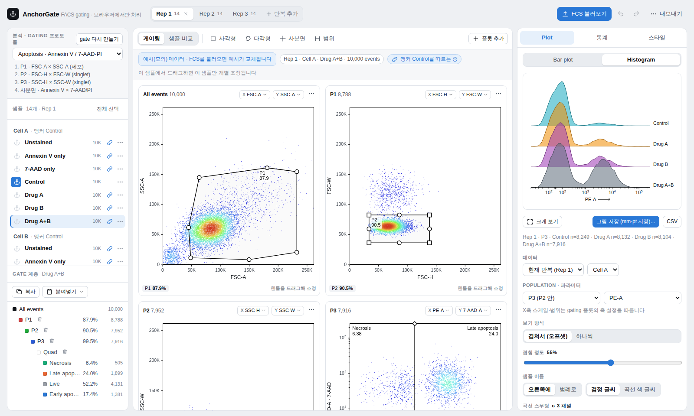
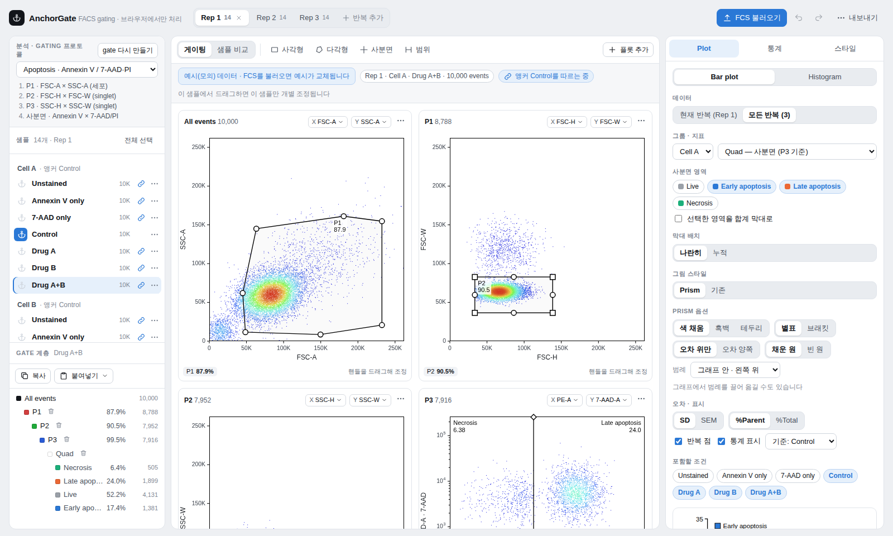
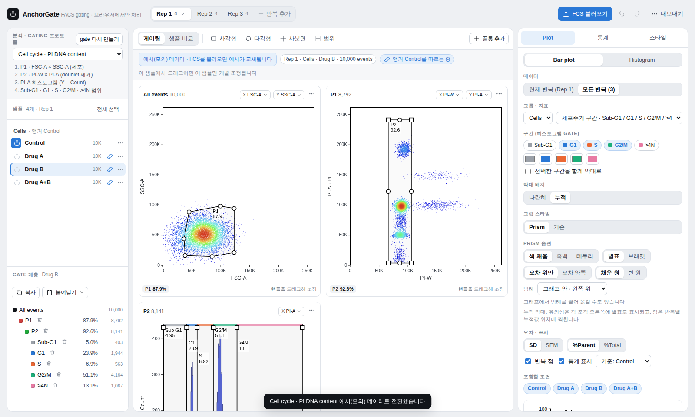

# Anchorgating

브라우저에서 바로 여는 FACS 게이팅·그림 도구입니다. Apoptosis(Annexin V / 7-AAD·PI)와 cell cycle(PI DNA content) 분석에 맞춰 만들었고, 설치 없이 `index.html` 하나로 동작합니다.

A zero-install, single-file web app for FACS gating and publication figures (apoptosis & cell cycle).

> **데이터는 업로드되지 않습니다.** FCS 파일은 사용자의 브라우저 안에서만 읽고 계산합니다. 서버·외부 라이브러리 호출이 없습니다.



| Bar plot (Prism) | Cell cycle |
|---|---|
|  |  |

## 사용법

| 방법 | 설명 |
|---|---|
| 웹 링크 | GitHub Pages 주소로 접속 → **FCS 불러오기** 또는 파일 드래그 |
| 오프라인 | `index.html`을 내려받아 Chrome/Edge/Safari로 열기 |

## 주요 기능

- **FCS 2.0 / 3.0 / 3.1 파서** — float·double·integer, byte order, `$SPILLOVER` 보정, 한글(EUC-KR) 키워드
- **분석 프로토콜 선택** — Apoptosis(P1 → P2/P3 singlet → 사분면), Cell cycle(P1 FSC-A×SSC-A → P2 PI-W×PI-A → PI-A 히스토그램 Sub-G1/G1/S/G2M/>4N), Custom. 파라미터 이름으로 자동 선택
- **앵커 게이팅** — ⚓ 샘플의 gate를 같은 그룹이 따라가고, 개별 샘플에서 드래그하면 그 gate만 override
- **반복(replicate) 탭** — 반복마다 독립된 gate, 조건 이름으로 반복 간 매칭
- gate 복사/붙여넣기, 되돌리기/다시하기, gate 템플릿 JSON 저장·불러오기
- **축** — 파라미터, linear / log / biexponential, 범위
- **플롯 스타일** — FlowJo pseudocolor, 밀도, 등고선, 점 크기, 팔레트·사용자 색, 사분면·gate 이름 더블클릭 수정
- **Plot 탭**
  - *Bar plot* — Prism 스타일(나란히/누적), 평균 ± SD/SEM, 반복 점, Welch t-test 별표/브래킷, 범례 위치 드래그
  - *Histogram* — 오프셋 겹침(겹침 정도 조절) 또는 하나씩 보기, 곡선 스무딩, % of max / Count, 조건별 색, 기준선, 구간 gate 표시
- **논문용 내보내기** — mm·pt 단위 크기, 300/600/1200 dpi PNG(dpi 메타데이터 포함), 편집 가능한 SVG, 통계·플롯 CSV

## 개발

소스는 `src/`에 나뉘어 있고 빌드는 파일을 순서대로 이어 붙이기만 합니다(의존성 없음).

```bash
python3 build.py        # src/ → index.html
```

| 파일 | 역할 |
|---|---|
| `src/00_shell.html` | 레이아웃·CSS |
| `src/10_core.js` | 유틸, 팔레트, 축 변환, FCS 파서, apoptosis 데모 데이터 |
| `src/20_model.js` | 상태, gate 트리·앵커·override, population 계산, undo |
| `src/25_protocol.js` | 분석 프로토콜, cell cycle 자동 gate·데모 |
| `src/30_plot.js` | 캔버스 렌더링·gate 드래그 |
| `src/40_ui.js` | 패널 UI, 스타일, 설정 저장 |
| `src/50_bar.js` / `56_prism.js` | Bar plot 모델·통계·Prism SVG |
| `src/57_hist.js` | Histogram(오프셋/하나씩) |
| `src/55_export.js` | mm·pt 그림 내보내기 |
| `src/60_boot.js` | 파일 로드, 부팅, 단축키 |

## 예시 데이터

처음 열면 나오는 샘플은 모두 **시뮬레이션 값**입니다. Apoptosis 예시: 그룹 `Cell A`, `Cell B` × `Unstained`, `Annexin V only`, `7-AAD only`, `Control`, `Drug A`, `Drug B`, `Drug A+B` × 3 반복. FCS를 불러오면 예시는 사라집니다.

## 한계

- 결과 검증용으로 FlowJo/FACSDiva 수치와 한 번은 비교해 주세요. gate 위치가 같으면 %는 같지만, 자동 gate 초기값은 소프트웨어마다 다릅니다.
- 세션 저장(작업 파일)은 아직 없습니다. gate는 **템플릿 JSON**으로 저장하세요.

## 인용 · 라이선스

MIT License — `LICENSE` 참조. 논문에 사용했다면 저장소 주소와 버전(`VERSION`)을 적어 주세요.

### 논문 Methods 예시 (Example Methods text)

#### Software

> Flow cytometry data were analyzed using Anchorgating (v0.9.1; https://smcho-ssj.github.io/anchorgating/), an open-source, browser-based flow cytometry gating and visualization tool that performs all computation client-side, with no data transmitted to a server. Anchorgating supports hierarchical (sequential) gating on dot, density, or contour plots; quadrant and histogram-region gating; linear, logarithmic, and biexponential axis transformation with spillover compensation; and gate propagation across paired samples within an experiment ("anchor" gating). Gated population statistics, publication-format figures, and gate-template files are exported directly from the tool.

#### Apoptosis

> For apoptosis analysis, cells were first gated on FSC-A × SSC-A to exclude debris, followed by FSC-H × FSC-W and SSC-H × SSC-W to exclude doublets. Live, early apoptotic, late apoptotic, and necrotic fractions were defined by quadrant gating on Annexin V-PE and 7-AAD within the singlet gate; quadrant boundaries were set on a representative control sample and propagated to all samples within the experiment. Population percentages were exported as CSV files, and bar graphs show mean ± SD (or SEM) from n = (replicate number) independent experiments, with statistical significance assessed by two-tailed Welch's t-test.

#### Cell cycle analysis

> For cell-cycle analysis, cells were gated on FSC-A × SSC-A, followed by PI-width × PI-area to exclude doublets. DNA content histograms (PI-A) were used to assign Sub-G1, G1, S, G2/M, and >4N fractions based on the corresponding histogram regions. Data are presented as mean ± SD (or SEM) from n = (replicate number) independent experiments.

#### Reproducibility

> Gating strategies and analysis parameters used to generate each figure are provided as Anchorgating gate-template JSON files (Supplementary Data).
